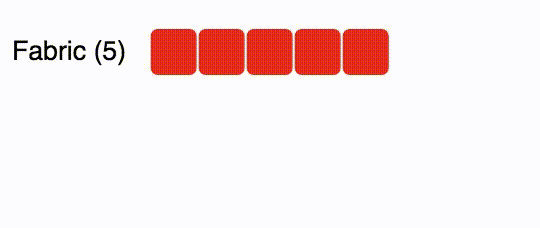

# d3-relationshipgraph [](https://travis-ci.org/hkelly93/d3-relationshipgraph) [](https://david-dm.org/hkelly93/d3-relationshipgraph.svg) [](https://david-dm.org/hkelly93/d3-relationshipgraph#info=devDependencies)
A framework for creating parent-child relationships with [D3.js](http://www.d3js.org).

## Examples
View a working example [here](https://cdn.rawgit.com/hkelly93/d3-relationshipGraph/master/examples/index.html).

### Visualizing Simulated [Plexxi Switch](http://www.plexxi.com) Health Changes During A Reboot


This gif shows how the simulated Plexxi Switch's health changes during a reboot. Initially, the switches start off as disconnected (red) and then they become disconnected from the fabric, causing them to have a parent of *Unattached*. Right after the switches reboot, the health is unknown (blue) until they rejoin the fabric and then the status changes to healthy (green).

If you have used d3-relationshipgraph, feel free to edit this readme and put a link and image for your example.

## Installation
You can install d3-relationshipgraph via [bower](http://bower.io)

```
$ bower install d3-relationshipgraph
```
You can also use [npm](http://npmjs.org)

```
$ npm install d3-relationshipgraph
```
Or by downloading the repository and running
```
$ npm install
```
in the directory.

## Usage
### Setup
Since d3.relationshipgraph extends the D3.js framework, it can be easily added to an existing project by adding the following

```html
<!-- Add D3.js -->
<script src="https://d3js.org/d3.v3.min.js"></script>

<!-- Add d3.relationshipgraph.min.js -->
<script src="path/to/scripts/d3.relationshipgraph.min.js"></script>
<link type="text/css" rel="stylesheet" href="path/to/css/d3.relationshipgraph.min.css">
````

Once the framework is added to the HTML file, graphs can be created using familiar D3 selections

```javascript
var json = [
        {
            "Movie Title": "Avatar",
            "parent": "20th Century Fox",
            "Value": "$2,787,965,087",
            "Year": "2009"
        },
        {
            "Movie Title": "Titanic",
            "parent": "20th Century Fox",
            "Value": "$2,186,772,302",
            "Year": "1997"
        }
    ];

var graph = d3.select('#graph').relationshipGraph({
    'showTooltips': true,
    'maxChildCount': 10,
    'showKeys': false,
    'thresholds': [1000000000, 2000000000, 3000000000]
}).data(json);
```

This simple code will produce the example at the beginning of the readme.

### Configuration

d3.relationshipgraph is configured by passing in a JavaScript object into the constructor. The object can have the following properties

```Javascript
config = {
    showTooltips: true, // Whether or not to show tooltips when the child block is moused over.
    maxChildCount: 10, // The maximum amount of children to show per row before wrapping.
    onClick: function(obj) {}, // The callback function to call when a child block is clicked on. This gets passed the JSON for the object.
    showKeys: true, // Whether or not to show the JSON keys in the tooltip
    thresholds: [100, 200, 300], // The thresholds for the color changes. If the values are strings, the colors are determined by the value of the child being equal to the threshold. If the thresholds are numbers, the color is determined by the value being less than the threshold.
    colors: ['red', 'green', 'blue'], // The custom color set to use for the child blocks. These can be color names, HEX values, or RGBA values.
    transitionTime: 1000, // The time in milliseconds for the transitions. Set to 0 to disable.
    truncate: 25 // The maximum length for the parent labels before they get truncated. Set to 0 to disable.
}
```

None of the configurations are required and they all have default values

```Javascript
config = {
    showTooltips: true,
    maxChildCount: 0, // When the value is 0, the max count is determined by the width of the parent element.
    onClick: function () { }, // no-op
    showKeys: true,
    thresholds: [], // All chiild blocks will be the same color.
    transitionTime: 1500,
    truncate: 0
}
```

### Updating with New Data
To update the relationship graph with new data, store the RelationshipGraph object and call the *data* function with the updated JSON

```Javascript
var json = [
        {
            "Movie Title": "Avatar",
            "parent": "20th Century Fox",
            "Value": "$2,787,965,087",
            "Year": "2009"
        },
        {
            "Movie Title": "Titanic",
            "parent": "20th Century Fox",
            "Value": "$2,186,772,302",
            "Year": "1997"
        }
    ];

var graph = d3.select('#graph').relationshipGraph({
    'showTooltips': true,
    'maxChildCount': 10,
    'showKeys': false,
    'thresholds': [1000000000, 2000000000, 3000000000]
});

graph.data(json);  // Add the first set of data.

json = [
        {
            "Movie Title": "Avatar",
            "parent": "20th Century Fox",
            "Value": "$2,787,965,087",
            "Year": "2009"
        },
        {
            "Movie Title": "Titanic",
            "parent": "20th Century Fox",
            "Value": "$2,186,772,302",
            "Year": "1997"
        },
        {
            "Movie Title": "Star Wars: The Force Awakens",
            "parent": "Walt Disney Studios",
            "Value": "$2,066,247,462",
            "Year": "2015"
        }
   ];

graph.data(json);  // Update the graph with new data.
````

## License
This project is licensed under the MIT license -- see the [LICENSE.md](LICENSE.md) file for details.

## Contributing
If you would like to contribute please ensure that the following passes

```
$ grunt test -v
```
before putting up a pull request.
